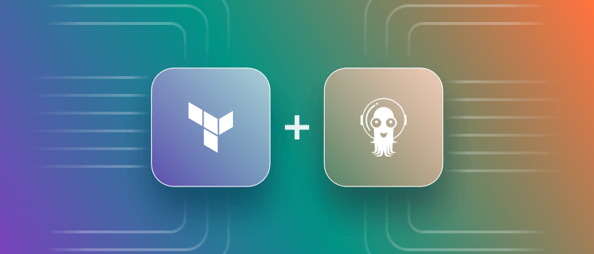

## Meu projeto de fluxo contínuo, com Argo CD.

<br>

<br>

Com um repositório GitHub bem estruturado, contendo pastas específicas para a aplicação, arquivos Terraform para provisionamento de infraestrutura, e manifests Kubernetes, é possível implementar um fluxo totalmente automatizado: do commit no código-fonte ao deploy da aplicação em um cluster Kubernetes.

O processo funciona conectando diferentes tecnologias. Sempre que houver alterações no código-fonte, um workflow gera automaticamente uma nova imagem Docker da aplicação. Em seguida, esse mesmo workflow atualiza o manifesto Kubernetes correspondente, armazenado na pasta designada. O ArgoCD, por sua vez, detecta essa atualização no manifesto e sincroniza a nova versão da aplicação no cluster, criando um fluxo contínuo e confiável de deploy automatizado.
<br><br>
#### Aqui está uma estrutura resumida do projeto:
```
della@ubuntu:~/projetos/project-argocd$ tree -L 5
.
├── app
│   ├── Dockerfile
│   ├── requirements.txt
│   └── src
│       ├── app.py
│       └── templates
│           └── index.html
├── infra
│   └── terraform
│       ├── backend.tf
│       ├── doks.tf
│       ├── network.tf
│       ├── provider.tf
│       ├── registry.tf
│       ├── terraform.tfvars
│       └── variables.tf
├── k8s
│   ├── app
│   │   ├── deployment.yaml
│   │   ├── ingress.yaml
│   │   └── service.yaml
│   └── argocd
│       ├── argocd-application.yaml
│       └── argocd-ingress.yaml
├── LICENSE
├── README.md
└── scripts
    ├── install-argocd.sh
    ├── install-cert-manager.sh
    ├── install-kubeconfig.sh
    └── install-nginx-ingress.sh

10 directories, 22 files
```
<br>

#### Fluxo Resumido:

1. Desenvolvimento e Push no Código-fonte:
	- Você faz alterações no diretório app/ e dá push para o repositório.
2. GitHub Actions Aciona Workflow:
	- O workflow é acionado ao detectar mudanças em app/.
3. Ele:
    - Faz o build da imagem Docker.	    
	- Faz o push da imagem para o registro (ex.: Docker Hub).	    
	- Atualiza o Deployment.yaml no diretório k8s/ com a nova tag da imagem.
4. ArgoCD Observa Alterações:
	- O ArgoCD monitora a pasta k8s/.
	- Ao detectar o novo Deployment.yaml, ele sincroniza automaticamente com o cluster Kubernetes.
6. Cluster Atualizado:
    - A nova versão da aplicação é implantada no cluster Kubernetes.

<br><br>

#### Fluxo Visual:

**[app/]** → Alteração no código-fonte → Push para GitHub

**↓**

**[GitHub Actions Workflow]**:

- Build da imagem Docker

- Push da imagem para o registro (Docker Hub)

- Atualiza **[k8s/Deployment.yaml]**

**↓**

**[k8s/]** → ArgoCD monitora a pasta → Detecta mudanças

**↓**

ArgoCD sincroniza com o cluster Kubernetes → Nova versão online

<br>

---

<br>

## Detalhamento Técnico do Projeto

### Infraestrutura na Digital Ocean

O projeto utiliza a Digital Ocean como provedor de cloud, com uma configuração Terraform que provisiona:

- **Cluster Kubernetes (DOKS)**:
  - Versão personalizada do Kubernetes
  - Integração nativa com registro de containers
  - Node Pool com auto-scaling configurado (min: ${var.min_nodes}, max: ${var.max_nodes})
  - VPC dedicada para isolamento de rede

- **Container Registry**:
  - Registro privado na Digital Ocean
  - Credenciais com expiração de 1 hora (3600 segundos)
  - Integração automática com o cluster DOKS

### Aplicação Flask

Uma aplicação web minimalista em Python que:
- Roda na porta 8080
- Utiliza a imagem base `python:3.9-slim` para menor footprint
- Expõe informações do hostname do pod
- Interface simples renderizada via template HTML

### Configuração Kubernetes

#### Deployment
- **Escalabilidade**: 10 réplicas para alta disponibilidade
- **Imagem**: Hospedada no registro privado da Digital Ocean
- **Namespace**: default
- **Labels**: Consistentes para fácil identificação e seleção

#### Argo CD
- **Sync Policy**: 
  - Automático com `selfHeal: true`
  - Prune habilitado para limpar recursos obsoletos
  - Criação automática de namespaces
- **Source**: 
  - Branch: HEAD (última versão)
  - Path: k8s/app
  - Monitoramento contínuo do repositório Git

### Scripts de Automação

O diretório `scripts/` contém utilitários essenciais:
1. `install-nginx-ingress.sh`: Configura o controlador de ingress
2. `install-cert-manager.sh`: Gerenciamento de certificados SSL/TLS
3. `install-argocd.sh`: Deploy do Argo CD
4. `install-kubeconfig.sh`: Configuração do acesso ao cluster

### Fluxo de Deploy Detalhado

1. **Provisionamento Inicial**:
   ```bash
   cd infra/terraform
   terraform init && terraform apply
   ```
   - Cria cluster DOKS
   - Configura registro de containers
   - Gera arquivo kubeconfig

2. **Configuração do Cluster**:
   - Instalação do Nginx Ingress
   - Configuração do Cert Manager
   - Deploy do Argo CD

3. **Deploy da Aplicação**:
   - Push do código para o GitHub
   - Build automático da imagem
   - Update do manifesto Kubernetes
   - Sincronização via Argo CD

### Comandos Úteis

**Verificar Status dos Pods**:
```bash
kubectl get pods -l app=podname
```

**Logs da Aplicação**:
```bash
kubectl logs -f -l app=podname
```

**Status do Argo CD**:
```bash
kubectl get applications -n argocd
```

### Arquitetura de Rede

- Aplicação exposta na porta 8080
- Ingress configurado para roteamento de tráfego
- VPC isolada na Digital Ocean
- Comunicação segura entre pods

### Próximos Passos e Melhorias

1. **Monitoramento**:
   - Implementar Prometheus para métricas
   - Configurar Grafana para visualização

2. **Segurança**:
   - Implementar Network Policies
   - Configurar SecurityContext nos pods
   - Adicionar scanning de vulnerabilidades

3. **Alta Disponibilidade**:
   - Configurar pod disruption budgets
   - Implementar health checks mais robustos
   - Adicionar estratégias de backup

---

<br>

**Essa estrutura e fluxo garantem uma integração limpa e automatizada entre desenvolvimento, CI/CD e o cluster Kubernetes.**
