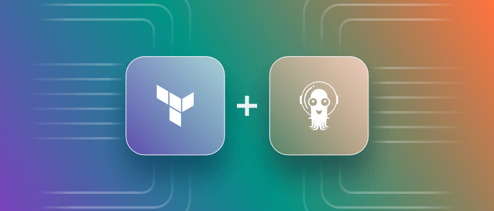

<h1 align="center">Projeto de fluxo contínuo com Argo CD</h1>

<br>

<div align="center">

</div>

<div align="center">

[](https://github.com/dellabeneta/project-argocd/actions)
[](https://github.com/dellabeneta/project-argocd/releases) [](https://github.com/dellabeneta/project-argocd/blob/main/LICENSE) [](https://github.com/dellabeneta/project-argocd/tree/main/infra/terraform) 
[](https://kubernetes.io/docs/) [](https://argo-cd.readthedocs.io/)
</div>

<br>

<div align="justify">
Com um repositório GitHub bem estruturado, contendo pastas específicas para a aplicação, arquivos Terraform para provisionamento de infraestrutura e manifests Kubernetes, é possível implementar um fluxo totalmente automatizado: do commit no código-fonte ao deploy da aplicação em um cluster Kubernetes.
<p><p>
O processo funciona conectando diferentes tecnologias. Sempre que houver alterações no código-fonte, um workflow gera automaticamente uma nova imagem Docker da aplicação. Em seguida, esse mesmo workflow atualiza o manifesto Kubernetes correspondente, armazenado na pasta designada. O ArgoCD, por sua vez, detecta essa atualização no manifesto e sincroniza a nova versão da aplicação no cluster, criando um fluxo contínuo e confiável de deploy automatizado.
</div>

<p align="right">
  <a href="https://www.digitalocean.com/?refcode=c231bd46146c&utm_campaign=Referral_Invite&utm_medium=Referral_Program&utm_source=badge">
    
  </a>
</p>

<br>

<div align="center">
	
<h2>Desenho da arquitetura</h2>	

<br>


</div>

<div align="center">
<h2>Vamos à prática</h2>	
</div>

<br>

#### Pré-requisitos:

- Terraform instalado
- Kubectl instalado
- Conta na Digital Ocean e Token de acesso
- Um domínio válido com zona de DNS ativa

#### Observações importantes:

- É necessário um arquivo `terraform.tfvars` seu, em `/infra/terraform`. [Clique aqui para copiar um modelo!](https://github.com/dellabeneta/project-argocd/blob/main/assets/tfvars-model)
- Eu usei o State do Terraform de maneira remota. É opcional mas, [clique aqui se quiser seguir essa boa prática!](https://github.com/dellabeneta/project-argocd/blob/main/assets/backend-model)
<br>

#### 1. Configure o Cluster Kubernetes

Abra seu terminal no path raiz do `projeto-argocd` e execute esses dois comandos para o terraform provisionar o DOKS (serviço gerenciado de Kubernetes da Digital Ocean):

```
terraform -chdir=infra/terraform init
```
```
terraform -chdir=infra/terraform apply --auto-approve
```
Após uma considerável espera, vamos checar o estado do componentes: 
```
kubectl get all -A
```
<br>

#### 2. Instalar o Ingress Controller (Nginx)

Seguindo em nosso terminal, vamos aos passos para criarmos nosso Nginx Ingress Controller:
```
kubectl apply \
  -f https://raw.githubusercontent.com/kubernetes/ingress-nginx/main/deploy/static/provider/cloud/deploy.yaml
```
Cheque o estado de tudo com: 
```
kubectl get all -A
```
O nosso IP Público estará como `pending` por uns 3 minutos. Após isso, já crie os subdomínios para seu ArgoCD e a aplicação. Eu tenho feito o meu dessa forma:
- argocd.seudominio.com ---> IP_DO_LOADBALANCER
- app.seudominio.com ---> IP_DO_LOADBALANCER

Aguarde as propagações. Monitore com https://www.whatsmydns.net/ ou `nslookup` e `dig` no terminal.

<br>

#### 3. Instale o Cert-Manager

Vamos preparar o Cert-Manager que será o principal elemento, responsável pelos nossos certificados de forma geral dentro do nosso Cluster K8S:
```
kubectl apply \
-f https://github.com/cert-manager/cert-manager/releases/download/v1.16.2/cert-manager.yaml
```
Aguarde os pods ficarem prontos:
```
kubectl wait --for=condition=Ready pods --all -n cert-manager --timeout=300s
```
Verifique se os CRDs foram aplicados corretamente:
```
kubectl get crds | grep cert-manager
```

<br>

#### 4. Crie um Cluster-Issuer para Let's Encrypt

Salve este YAML como `cluster-issuer.yaml` e aplique-o com `kubectl apply -f k8s/setup/cluster-issuer.yaml`.
```
# cluster-issuer.yaml
apiVersion: cert-manager.io/v1
kind: ClusterIssuer
metadata:
  name: letsencrypt-prod
spec:
  acme:
	server: https://acme-v02.api.letsencrypt.org/directory
    email: email@dominio.com
    privateKeySecretRef:
      name: letsencrypt-prod
    server: https://acme-v02.api.letsencrypt.org/directory
    solvers:
      - http01:
          ingress:
            class: nginx
```

<br>

#### 5. Ingress para o ArgoCD

Crie o namespace `argocd`:
```
kubectl create namespace argocd
```
Confira com:
```
kubectl get namespaces
```
Mesmo processo, salve o YAML como `argo-ingress.yaml` e aplique com `kubectl apply -f k8s/setup/argo-ingress.yaml`.
```
apiVersion: networking.k8s.io/v1
kind: Ingress
metadata:
  name: argocd-ingress
  annotations:
	nginx.ingress.kubernetes.io/force-ssl-redirect: "true"
	nginx.ingress.kubernetes.io/ssl-passthrough: "true"
	nginx.ingress.kubernetes.io/backend-protocol: "HTTPS"
	cert-manager.io/cluster-issuer: "letsencrypt-prod"  
spec:
	ingressClassName: nginx
	tls:
	- hosts:
	  - argocd.seudominio.com
	  secretName: argocd-server-tls
  rules:
  - host: argocd.seudominio.com
    http:
      paths:
      - path: /
        pathType: Prefix
        backend:
          service:
            name: argocd-server
            port:
              name: 443
```

<br>

#### 6. Setup do ArgoCD

Aplique o manifesto OFICIAL para o ArgoCD, nós já temos uma namespace com nome `argocd` e vamos utilizá-lo:
```
kubectl apply \
-n argocd \
-f https://raw.githubusercontent.com/argoproj/argo-cd/stable/manifests/install.yaml
```
Após alguns poucos minutos, ele estará no ar com seu certificado já emito pelo Cert-Manager + Ingress que criamos.

Você agora pode acessar pelo https://argocd.dominio.com.

Busque sua senha do `admin`, gerada automaticamente durante o provisionamento, com o comando:
```
kubectl get secret argocd-initial-admin-secret \
-n argocd \
-o jsonpath="{.data.password}" | base64 -d; echo
```

<br>

#### 7. Exemplo de YAML para "Application". Afinal de contas, agora você vai usar repositórios Git como fonte única de verdade.

Este projeto, que é um REPOSITÓRIO PÚBLICO, já possui uma aplicação de exemplo em `/app`, inclusive com Github Actions, que vai sempre fazer o CI da aplicação, ajustando a versão da imagem Docker no arquivo `deployment.yaml`, na linha 19 em `/k8s/app/`, que será consumido pelo ArgoCD. Ajuste conforme sua demanda.

Segue exemplo de YAML baseado **neste projeto**:
```
apiVersion: argoproj.io/v1alpha1
kind: Application
metadata:
  name: project-argocd
  namespace: argocd
spec:
  project: default
  source:
    repoURL: https://github.com/dellabeneta/project-argocd.git
    targetRevision: HEAD
    path: k8s/app
  destination:
    server: https://kubernetes.default.svc
    namespace: default
  syncPolicy:
    automated:
      prune: true
      selfHeal: true
    syncOptions:
      - CreateNamespace=true
```
Salve-o e aplique com, é claro, `kubectl apply -f k8s/argocd/application.yaml`

<br>

<div align="center">
<h2>Referências</h2>	
</div>

<br>

- https://argo-cd.readthedocs.io/en/stable/
- https://kubernetes.io/docs/
- https://kubernetes.io/docs/setup/
- https://kubernetes.io/docs/concepts/
- https://docs.docker.com/
- https://docs.docker.com/get-started/
- https://docs.docker.com/engine/reference/commandline/
- https://www.terraform.io/docs
- https://www.terraform.io/docs/providers/
- https://learn.hashicorp.com/collections/terraform/aws-get-started
- https://docs.github.com/en/actions
- https://docs.github.com/en/actions/using-workflows
- https://docs.github.com/en/actions/learn-github-actions
  <br>
